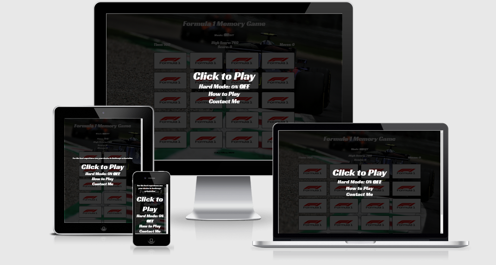

# F1 Memory Game



---

## [Project Repository](https://github.com/filleben/F1MemoryGame)

## [Deployed Site](https://filleben.github.io/F1MemoryGame)

---

This project is designed for Formula One fans like myself to provide a simple yet challenging memory game with a user-friendly design, the game will always lay out the cards differently as well as providing a user score, giving the users a reason to come back to the site and keep playing multiple games.

## Table of Contents

- <a href="#ux">UX</a>
- <a href="#features">Features</a>
- <a href="#technologies">Technologies Used</a>
- <a href="#testing">Testing</a>
- <a href="#deployment">Deployment</a>
- <a href="#credits">Credits</a>

<span id="ux"></span>

## UX

### User Goals

I expect that the majority of the users will fall into the following criteria:

- Be a Formula One Fan.
- A user looking for a time-waster.
- A user looking for a challenging memory game.

### User Stories

- As a user, I want the site to be simple to use and visually appealing.
- As a user, I want the cards to be shuffled every time I play it.
- As a user, I want to be able to see how well I am playing the game (Score).
- As a user, I want instructions on how to play the game.
- As a user, I want to have fun!.

### Wireframes

[Here](https://github.com/filleben/F1MemoryGame/tree/master/wireframes) are the designs I made for the site.

The wireframes were made using [Balsamiq](https://balsamiq.cloud)

### Design Choices

- **Font**: I wanted to use a single font throughout the site, it needed to look "racey" to fit in with the Formula 1 theme, with this in mind I decided to use [Racing Sans One](https://fonts.google.com/specimen/Racing+Sans+One) from [Google Fonts](https://fonts.google.com/).

- **Colours**: I decided to use a Formula 1 photo as my background, because of this I kept a consistent font colour of white (Hex: '#ffffff' RGB: 'rgb(255, 255, 255)') as it stands out the best from the background. The cards needed to be highlighted when you are hovering over them so I chose a to use a linear gradient of these two colours: Hex: '#b2a9e5', RGB: 'rgb(178,169,229)' and Hex: '#2b94e5', RGB: '(43,148,229)'. Lastly, I chose a simple green colour (Hex: '#16A353' RGB:'rgb(22,163,83)') to highlight when two cards were matched.

<span id="features"></span>

## Features

- **Game Instructions**: Tells users how to play the game.
- **Contact Form**: Allows users to contact me directly to report any bugs with the game.
- **Success/Failed Messages**: Tells users if they successfully contacted me or not.
- **Music**: 8-bit Formula 1 theme plays when you begin the game.
- **Game Timer**: When the game starts a timer begins counting down from 100 when it hits zero the game is over.
- **Move Counter**: Counts how many moves a user makes while playing.
- **Scoring System**: Users get points for each match they find, the quicker they find a match the more points they will receive.
- **High Score Saving**: The game will save the users highest score between sessions in local storage.
- **Game Over Screen**: When the timer hits zero the game over screen will appear allowing the users to try again.
- **Victory Screen**: When the user has found all 10 matches before the time runs out the Victory screen will appear showing their score and allowing them to play again.
- **Screen Size Message**: If the user is using a device with a small screen a message will appear letting them know the game will be better in landscape orientation.
- **Defense Function**: The game will not allow cards to be flipped if there is a card animation taking place.
- **Defense Function**: The game will not allow a card to be flipped if it is part of a matched pair.
- **Defense Function**: The game will allow the same card to be flipped back to hidden until a second card has been selected to check for a match.

## Features Left to Implement

- Global leaderboard based on game scores.
- Global leaderboard based on how fast users beat the game.
- Different game modes such as classic F1 cars and F1 tracks.

<span id="technologies"></span>

## Technologies Used

- [HTML5](https://en.wikipedia.org/wiki/HTML5)
  - The project uses **HTML5** to provide the content and structure.

- [CSS3](https://en.wikipedia.org/wiki/Cascading_Style_Sheets)
  - The project uses **CSS3** for styling.

- [Google Fonts](https://fonts.google.com/)
  - The project uses **Google Fonts** to provide the font used on the site.

- [jQuery](https://jquery.com)
  - The project uses **jQuery** for game functions.

- [JavaScript](https://www.javascript.com/)
  - The project uses **JavaScript** for game functions.

- [EmailJS](https://www.emailjs.com/)
  - The project uses **EmailJS** to send emails based on provided contact information.

- [VSCode](https://code.visualstudio.com/)
  - The project developed in  **Visual Studio Code**.

- [Git](https://git-scm.com/)
  - The project uses **Git** for version control.

- [GitHub](https://github.com/)
  - The project uses **GitHub** to host the repository and for the live preview of the site.

<span id="testing"></span>

## Testing

### Testing Tools

#### I used the following tools and devices to test the website in several different scenarios. 

- [Firefox Developer Tools](https://developer.mozilla.org/en-US/docs/Tools)
  - The project used **Firefox Developer Tools** to test responsiveness, styles, and different layouts throughout development. This also allowed the site to be tested on several other [mobile devices](https://developer.mozilla.org/en-US/docs/Tools/Responsive_Design_Mode).

##### Devices I Physically Tested With. 

- [Samsung Note 10+](https://en.wikipedia.org/wiki/Samsung_Galaxy_Note_10)
  - The project used a **Samsung Note 10+** to test the site on a mobile device.

- [HP Envy x360 13](https://www.amazon.co.uk/HP-13-ar0001na-Touch-Screen-Convertible-Laptop/dp/B07V3J1H3V)
  - The project used an **HP Envy x360 13** to test the site on both a 13-inch laptop and a tablet.

##### Devices Simulated With In Firefox Dev Tools. 

- [Samsung Galaxy S9/S9+](https://en.wikipedia.org/wiki/Samsung_Galaxy_S9)

- [iPhone 6/7/8](https://en.wikipedia.org/wiki/IPhone_6)

- [iPhone X](https://en.wikipedia.org/wiki/IPhone_X)

- [iPad](https://en.wikipedia.org/wiki/IPad)


I used the following web browsers on both desktop (Windows) and mobile (Android) where available.

- [Mozilla Firefox](https://www.mozilla.org/en-GB/)
  - Desktop Version: 76.0.1 Mobile Version: 75.0.0-beta.6

- [Google Chrome](https://www.google.com/chrome/)
  - Desktop Version: 81.0.4044.138 Mobile Version: 81.0.4044.138

- [Opera](https://www.opera.com/)
  - Desktop Version: 68.0.3618.99

- [Microsoft Edge](https://www.microsoft.com/en-us/edge)
  - Desktop Version: 44.18362.449.0

The project was run through both [HTML Validation](https://validator.w3.org/) and [CSS Validation](https://jigsaw.w3.org/css-validator/validator) with no errors found.

I had originally planned to test my project with Jasmine testing, but with the way my project ended up it would require me to write extra code just to be able to test functions. With that in mind, I did manual testing which can be seen [here](https://github.com/filleben/F1MemoryGame/tree/master/testing/js-testing.pdf)

HTML and CSS tests carried out have been documented and visualised [here](https://github.com/filleben/F1MemoryGame/tree/master/testing/site-testing.pdf)

### User Story Tests

1. Site is simple and visually appealing:
   - The feedback I have received so far indicates that this is true.

2. Cards are shuffled every game:
  1. Click on "Click to Start", cards are shuffled.
  2. Beat the game.
  3. Click on "Restart", cards are shuffled.

3. Game is Scored:
  1. Click on "Click to Start".
  2. Get a match in the game, Score increases.

4. Instructions on how to play the game:
  1. Click on "How to Play"
  2. View instructions.

### All tests performed with no errors found.

### Issues Found During Testing

- Background image repeated vertically on mobile devices, fixed by adding further styling options to the body.
- While testing on other browsers other than Firefox which was used during site development, I released that the high score wasn't being saved, this issue was fixed by adding localStorage.setItem to my setHighScore() function.
- If the game was being played for the first time the "High Score:" would display undefined until it was set when you beat the game, this issue was fixed by adding an if statement inside the document ready function.

<span id="deployment"></span>

## Deployment

To deploy this page to GitHub Pages from its [GitHub repository](https://github.com/filleben/TenburyWellsRFC), the following steps were taken: 

1. From the menu items near the top of the page, select **Settings**.
2. Scroll down to the **GitHub Pages** section.
3. Under **Source** click the drop-down menu labelled **None** and select **Master Branch**
4. On selecting Master Branch the page is automatically refreshed, the website is now deployed. 
5. Scroll back down to the **GitHub Pages** section to retrieve the link to the deployed website.

 
To clone this project from GitHub:

1. Under the repository name, click "Clone or download".
2. In the Clone with HTTPs section, copy the clone URL for the repository. 
3. Open your IDE of choice.
4. Change the current working directory to the location where you want the cloned directory to be made.
5. Type `` `git clone` ``, and then paste the URL you copied in Step 3.
```console
git clone https://github.com/filleben/TenburyWellsRFC
```

6. Press Enter. Your local clone will be created.

Further reading and troubleshooting on cloning a repository from GitHub can be found [here](https://help.github.com/en/articles/cloning-a-repository).

<span id="credits"></span>

## Credits

### Content

- I achieved base game functionality by following [this tutorial](https://www.youtube.com/watch?v=3uuQ3g92oPQ) by [PortEXE](https://www.portexe.com/)
- I got my scoring working by using code from [Stack Overflow](https://stackoverflow.com/questions/6507216/javascript-addition-add-10-to-an-interger)
- The game uses the [Fisher-Yates shuffle](https://en.wikipedia.org/wiki/Fisher%E2%80%93Yates_shuffle) to shuffle the cards.
- I styled the background site image using code from [CSS Tricks](https://css-tricks.com/perfect-full-page-background-image/)

### Media

- The Formula 1 Logo was taken from the [Formula 1 Official Site](https://www.formula1.com/).
- The background image used was taken from the [Formula 1 Official Site](https://www.formula1.com/).
- The Formula 1 car images are taken from the [Formula 1 Official Site](https://www.formula1.com/).
- The background music was made by [victoresto99](https://www.youtube.com/watch?v=ptRV4Ut2dNk).

### Acknowledgements

- I received inspiration for this project from [WebDevSimplified](https://github.com/WebDevSimplified) and their [Mix-Or-Match project](https://github.com/WebDevSimplified/Mix-Or-Match).
- **Gerard McBride** for helping me through the project with his advice and guidance.   